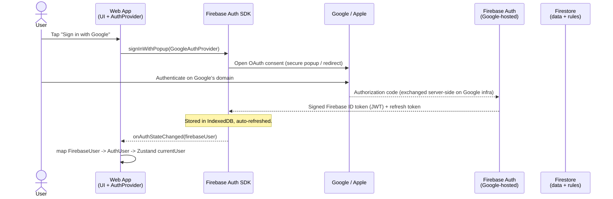
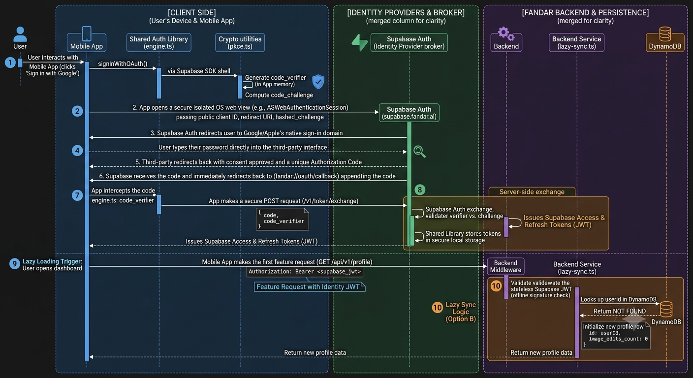

# Auth — LLD Decisions

> **Active design: Firebase Authentication.** The fan-zone app is Firestore-direct (clients read/write Firestore under security rules), so Firebase Auth is the coherent choice — Google operates the OAuth code exchange, the client SDK manages tokens/refresh/persistence, and `request.auth.uid` is verified **natively** by Firestore rules with no backend tier. The earlier Supabase + `@fandar/auth-engine` design is preserved in the **Appendix** as a future, platform-grade architecture (for when a custom backend + multi-app platform exist); it is **not** the current implementation. See `AUTH_HLD_DECISIONS.md` for the high-level rationale.

## Sign-in Flow (Firebase OAuth)

Google operates the OAuth code exchange end-to-end — the app never handles an authorization code, PKCE verifier, or token exchange. One SDK call returns a signed Firebase ID token (JWT) that Firestore rules verify natively.



(Rendered image: `assets/firebase-auth-sequence.png`, once generated. Compare with the deferred Supabase/PKCE flow in `assets/authSequenceDiagram.png`.)

## User Metadata — `users/{uid}` (lazy-initialized)

Per-user app metadata (e.g. how many times a user has checked in) lives in a Firestore **`users/{uid}`** document — the Firebase equivalent of the Appendix's `users` table, but just another Firestore collection (no separate DB, no backend):

```
users/{uid} = { checkin_count: number, displayName, email, created_at }
```

**Lazy init (Option B):** the doc is created the first time it's needed, not at sign-up — avoids empty "ghost" records:

```ts
setDoc(doc(db, 'users', uid), { checkin_count: increment(1) }, { merge: true });
// 1st call: doc doesn't exist -> created as { checkin_count: 1 }
// later:    increments in place
```

**Rule:** `match /users/{uid} { allow read, write: if request.auth.uid == uid; }` — a user only touches their own doc.

**Integrity note:** a client-side `increment` is tamperable (it's the user's own doc) — acceptable for a low-stakes metric. The tamper-proof version (raw check-ins in a write-only `check_ins` collection + server-side aggregation into `users/{uid}.checkin_count`) is tracked under the **"Secure check-in / live-status writes"** backlog item. `checkin_count` can start client-incremented and later become server-derived — same `users/{uid}` home.

> Check-in is currently disabled, so the increment hooks in when check-in is re-enabled; the model + rule ship now.

## Web Implementation (Firebase) — Phase 9

### UX Pattern: Lazy Auth (No Login Page)

There is no dedicated login/signup page. Auth is triggered in two ways:
- **ProfileAvatar** in the top bar — always visible; tapping it when signed out opens the `AuthSheet`
- **Write actions** (Check-in, RSVP, Create watch party) — attempting these while signed out opens the `AuthSheet` first, then resumes the original action on success

The map and discovery experience are fully open to unauthenticated users.

### Components (`apps/web/components`)

| Component | Responsibility |
|---|---|
| `AuthProvider.tsx` | Client component wrapping the layout; runs `onAuthStateChanged` on mount, maps `FirebaseUser → AuthUser`, writes to Zustand |
| `AuthSheet.tsx` | Bottom sheet with Google, Apple, Email/Password options; accepts `onSuccess?: () => void` callback to resume pending action after sign-in |
| `ProfileAvatar.tsx` | Always visible in top bar; signed-out → opens `AuthSheet`; signed-in → shows photo or initials, opens `ProfileSheet` |
| `ProfileSheet.tsx` | Mini bottom sheet: display name, email, sign-out button |

### Auth Lib (`apps/web/lib/auth.ts`)

Single file for all Firebase Auth calls:
- `signInWithGoogle()` — `signInWithPopup` + `GoogleAuthProvider`
- `signInWithApple()` — `signInWithPopup` + `OAuthProvider('apple.com')`
- `signInWithEmail(email, password)` — `signInWithEmailAndPassword`
- `signOut()` — `signOut(auth)`

### Shared Data Model (`packages/shared`)

```ts
type AuthUser = {
  uid: string;
  displayName: string | null;
  email: string | null;
  photoURL: string | null; // null for Apple sign-in
};
```

Zustand store additions: `currentUser: AuthUser | null` + `setCurrentUser`

### Gating Write Actions (`apps/web/app/page.tsx`)

Pending action pattern — `AuthSheet` receives `onSuccess` callback:

```ts
function handleCreateParty(...args) {
  if (!currentUser) {
    openAuthSheet(() => handleCreateParty(...args));
    return;
  }
  // proceed
}
```

Same pattern applies to check-in and RSVP when those are built (Phase 10).

| Action | Auth required |
|---|---|
| Browse map / venues | ❌ |
| Create watch party | ✅ |
| Check-in | ✅ |
| RSVP | ✅ |

### `created_by` Population (`CreateWatchPartySheet.tsx`)

```ts
{ ...partyData, created_by: currentUser!.uid }
```

### Layout Wiring (`apps/web/app/layout.tsx`)

Wrap children with `<AuthProvider>` so `onAuthStateChanged` runs once at the app root and every component can read `currentUser` from Zustand.

### One-Time Firebase Console Setup (Prereqs)

| Task | Location |
|---|---|
| Enable Email/Password provider | Firebase Console → Auth → Sign-in method |
| Enable Google provider | Firebase Console → Auth → Sign-in method |
| Enable Apple provider | Firebase Console → Auth → Sign-in method |
| Add `fandar.ai` to authorized domains | Firebase Console → Auth → Settings → Authorized domains |
| Apple: create Service ID + private key | Apple Developer Console → Certificates, IDs & Profiles |

---

## Mobile Implementation (Firebase) — Expo

Mobile **reuses everything platform-agnostic**: the `AuthUser` type, the Zustand `currentUser`,
the `onAuthStateChanged → AuthUser → store` pattern, the lazy-auth UX, and `created_by = uid`.
What differs is **how a provider credential is obtained** — `signInWithPopup` does not exist in
React Native, so each social provider uses a **native** flow that yields a credential, which is
then handed to Firebase via **`signInWithCredential`**.

> Since the app already runs as a custom Expo **dev client** (Mapbox's `@rnmapbox/maps` requires
> it, so Expo Go was never an option), the native Google/Apple sign-in modules add **no new
> constraint** — they compile into the same build. The code snippets below show the **approach
> only**; confirm exact APIs against the **Expo SDK 56 docs** when implementing (per
> `apps/mobile/AGENTS.md`).

### Provider matrix (mobile)

| Provider | iOS | Android | Native flow |
|---|---|---|---|
| Google | ✅ | ✅ | `@react-native-google-signin/google-signin` → `idToken` → `signInWithCredential` |
| Apple | ✅ | ❌ | `expo-apple-authentication` → identity token + nonce → `signInWithCredential` |
| Email / Password | ✅ | ✅ | `firebase/auth` directly (same calls as web) |

Apple is **iOS-only** — hide the Apple button on Android.

### Firebase init difference — React Native persistence (`apps/mobile/lib/firebase.ts`)

Web's `getAuth(app)` uses browser persistence (IndexedDB), which RN doesn't have — so the session
must persist via AsyncStorage, or the user is signed out on every relaunch:

```ts
import { initializeAuth, getReactNativePersistence } from 'firebase/auth';
import AsyncStorage from '@react-native-async-storage/async-storage';

export const auth = initializeAuth(app, {
  persistence: getReactNativePersistence(AsyncStorage),
});
// (import path for getReactNativePersistence varies by firebase version — verify)
```

### Auth lib (`apps/mobile/lib/auth.ts`)

Same function surface as web (`signInWithGoogle/Apple/Email`, `signUpWithEmail`, `signOut`); the
Google/Apple bodies use native flows then `signInWithCredential`:

```ts
// Google — native sheet → idToken → Firebase credential
// GoogleSignin.configure({ webClientId }) once at startup (webClientId = Firebase Web client ID)
const { idToken } = await GoogleSignin.signIn();
await signInWithCredential(auth, GoogleAuthProvider.credential(idToken));

// Apple (iOS) — random rawNonce; pass SHA-256(rawNonce) to Apple, rawNonce to Firebase
const cred = await AppleAuthentication.signInAsync({ requestedScopes: [...], nonce: hashedNonce });
const provider = new OAuthProvider('apple.com');
await signInWithCredential(auth, provider.credential({ idToken: cred.identityToken, rawNonce }));
```

Email/Password is identical to web (the JS SDK calls work unchanged in RN).

### Reused from web (no change)

- **Auth listener**: an `onAuthStateChanged(auth, …)` effect mapping `FirebaseUser → AuthUser → setCurrentUser`, mounted once at the app root (wrapping the root layout / navigator). Same store + same `AuthUser` from `@sfw/shared`.
- **Gating + `created_by`**: the create flow checks `currentUser`, opens the sign-in sheet with a resume callback (exactly like web), and writes `created_by = currentUser.uid` in `apps/mobile/components/CreateWatchPartySheet.tsx` (currently `''`).

### Components (`apps/mobile/components`)

RN versions of the three web components, built with the mobile design system (`StyleSheet` +
the existing bottom-sheet `Animated` pattern from `CreateWatchPartySheet`):

| Component | Responsibility |
|---|---|
| auth listener (hook or `AuthGate`) | `onAuthStateChanged` → store |
| `SignInSheet.tsx` | Bottom sheet: Google + Apple (iOS only) + Email/Password; `onSuccess` resume |
| `ProfileSheet.tsx` | Name / email / sign out |
| `ProfileAvatar.tsx` | Top-bar avatar; routes to the correct sheet |

### One-time native + console setup (prereqs)

| Task | Where |
|---|---|
| Enable Email/Password + Google + Apple providers | Firebase Console → Auth → Sign-in method (**shared with web**) |
| Google: iOS + Android OAuth client IDs; `GoogleService-Info.plist` / `google-services.json` | Firebase Console → Project settings; wired via `app.config.ts` + EAS secrets |
| Google: `webClientId` for `GoogleSignin.configure` | Firebase Console → Auth → Google provider (Web client ID) |
| Apple: "Sign in with Apple" capability/entitlement | `app.config.ts` (expo-apple-authentication) + Apple Developer App ID/Service ID — **blocked on the iOS App ID registration (see backlog)** |
| Native deps (require an EAS dev-client rebuild) | `@react-native-google-signin/google-signin`, `expo-apple-authentication`, `@react-native-async-storage/async-storage` |

### Sequencing note

Once mobile also sends authenticated creates (`created_by = uid`), the deferred **venue
create-auth enforcement** (`request.auth != null && created_by == request.auth.uid`) can finally
be enabled in `firestore.rules` for both platforms.

---

## Appendix — Future Platform Architecture (Supabase + `@fandar/auth-engine`) — DEFERRED

> **Status: NOT the current implementation.** This design targets a future Fandar *platform* with a custom backend API, portable identity, and multi-app auth (e.g. Instagram publishing). It is preserved here for that phase. The active app uses Firebase Auth (above); adopting this would require building a backend tier and bridging or replacing Firestore-direct data access.

# System Design Documentation: Unified Authentication & Identity Architecture
**Project:** Fandar App & Platform
**Architecture Pattern:** Decoupled Shared Library + Managed Identity + Lazy-Initialized Metadata

---

## 1. System Overview & Boundaries

This system design defines a highly secure, platform-agnostic, and reusable authentication infrastructure for Web and Mobile applications. To avoid code duplication, security holes, and structural bottlenecks, the system is strictly split into three boundaries:

1. **Shared Common Library (`@fandar/auth-engine`):** A framework-agnostic TypeScript package that encapsulates the client-side state machine, handles crypto configurations, and intercepts network loops. It contains zero UI code and zero hardcoded app secrets.
2. **Frontend Consumer Applications (Web/Mobile UI):** Applications that import the shared library. Their job is strictly UI presentation, native operating system hook invocation (e.g., native Apple/Google login sheets), and injecting platform-specific storage drivers.
3. **Backend API Server & Database (AWS Environment):** A secure private network executing business logic, acting as a resource consumer via stateless token validation, and utilizing an independent DynamoDB persistence layer for custom application metadata.

---

## 2. Codebase Directory Blueprints

### I. Shared Library Architecture (`@fandar/auth-engine`)

* **Directory Structure:**
  ```
  shared-auth-lib/
  ├── src/
  │   ├── index.ts                 # Main entry point exposing the client & interfaces
  │   ├── core/
  │   │   ├── auth-client.ts       # Main Orchestrator state machine
  │   │   └── pkce.ts              # Crypto utilities for Verifier/Challenge generation
  │   ├── http/
  │   │   └── api-client.ts        # Axios/Fetch wrapper with automatic 401 refresh interceptor
  │   └── storage/
  │       └── storage-interface.ts # Interface that tells frontends how to supply storage
  ```

* **Key Logic Stored Here:**
  * `pkce.ts`: Uses the Web Crypto API (`crypto.subtle`) to generate random octet strings (Verifier) and compute SHA-256 hashes (Challenge) client-side.
  * `auth-client.ts`: Configures and holds the initialization code for the underlying identity engine (`supabase-js`), managing client lifecycle states (`IDLE`, `AUTHENTICATING`, `LOGGED_IN`, `EXPIRED`).
  * `api-client.ts`: Implements an outgoing network client interceptor. If an application request fails with a `401 Unauthorized`, it temporarily pauses subsequent calls, fires a background token refresh request via the identity client, updates local storage, and replays the original requests seamlessly.

* **Responsibility Matrix:**

  | Operational Task | Shared Library (`@fandar/auth-engine`) | Frontend Consumer App | Supabase / Backend Server |
  |---|---|---|---|
  | PKCE Crypto Setup | ✅ Calculates verifiers/challenges automatically | | |
  | Silent Token Refresh Loops | ✅ Intercepts 401 errors and updates state in background | | |
  | Platform Storage Bridges | ✅ Passes down iOS Keychain / Browser localStorage engine | | |
  | UI Presentation | | ✅ Renders login screens and native Apple sheet triggers | |
  | Identity Database Persistence | | | ✅ Supabase tracks the core auth identities |
  | Server-Side Secret Isolation | | | ✅ API Server hides private keys and encrypts Instagram data |

### II. Frontend Client Architecture (Web/Mobile App)

* **Directory Structure:**
  ```
  frontend-client-app/
  ├── src/
  │   ├── config/
  │   │   └── auth-init.ts         # Instantiates the shared engine with platform specs
  │   ├── components/
  │   │   ├── GoogleLoginButton.tsx # Triggers Google OAuth sheet, hands result to engine
  │   │   └── InstagramConnect.tsx  # Dedicated button to request Instagram publishing scopes
  │   └── hooks/
  │       └── useAuth.ts           # Framework hook (e.g., React/Vue) mapping engine state to UI
  ```

* **Key Logic Stored Here:**
  * `auth-init.ts`: Injects platform-specific drivers into the shared library interface. On Web, it passes a wrapper around `localStorage` or secure cookies. On Mobile, it passes a native driver bridging token persistence to the hardware-encrypted iOS Keychain or Android EncryptedSharedPreferences.
  * `GoogleLoginButton.tsx`: Handles platform-specific UI windows. On web, it uses browser redirects or popups. On mobile, it triggers sandboxed system frameworks like iOS's `ASWebAuthenticationSession`. Once it intercepts the callback URL containing the authorization parameter (`?code=`), it hands execution control to the shared engine.

### III. Backend API Server Architecture (Node.js/TypeScript)

* **Directory Structure:**
  ```
  backend-api-server/
  ├── src/
  │   ├── controllers/
  │   │   ├── auth.controller.ts        # Implements /auth/callback and /auth/refresh
  │   │   └── integration.controller.ts # Implements /integrations/instagram/callback
  │   ├── services/
  │   │   ├── provider-exchange.service.ts # Communicates server-to-server with Google/Apple/Insta
  │   │   └── crypto.service.ts         # Encrypts third-party tokens before writing to DB
  │   └── middleware/
  │       └── require-auth.middleware.ts # Validates YOUR stateless App Access Token (JWT)
  ```

* **Key Logic Stored Here:**
  * `provider-exchange.service.ts`: Isolates private third-party application credentials (`INSTAGRAM_CLIENT_SECRET`) within secure environment variables. It executes server-to-server code-to-token swaps.
  * `crypto.service.ts`: Encrypts incoming third-party feature tokens using an industry-standard symmetric algorithm (e.g., AES-256 GCM) prior to database persistence. This ensures that a database compromise does not leak raw social posting permissions.
  * `require-auth.middleware.ts`: High-speed stateless gateway interceptor. It decodes and verifies the signature of incoming Supabase JWTs completely offline using your project's public signing key. If the signature matches, it extracts the `userId` claim and skips database session lookups entirely.

---

## 3. Protocol Flow & Execution Grid

The system leverages the OAuth 2.0 Authorization Code Flow with PKCE to protect public frontend components from interception attacks on shared device channels.

```
[ CLIENT SIDE ]                      [ THIRD PARTY ]                [ BACKEND SIDE ]
User's Device & Browser              Google / Apple / Insta         Your API & Database
   │                                       │                               │
   ├─► 1. Run Shared Lib Crypto            │                               │
   ├─► 2. Launch Secure View ─────────────►│                               │
   │                                       ├─► 3. User types password      │
   │◄──────────────────────────────────────┴─► 4. Consent Approved         │
   ├─► 5. App Intercepts Code              │                               │
   ├─► 6. Send Code + Verifier ───────────────────────────────────────────►│
   │                                       │◄──────────────────────────────┼─► 7. Server Swap (Secret)
   │                                       └──────────────────────────────►│   ├─► 8. Read/Write DB
   │◄──────────────────────────────────────────────────────────────────────┴───┘ 9. Issue App JWT
```



### The PKCE Mechanism Explained
1. **The Secret Generation:** Before any navigation occurs, the client app generates a secure random string (the Code Verifier) and passes a hashed variation (the Code Challenge) to the identity provider. The Verifier is locked safely within the application's isolated memory sandbox.
2. **The Handshake & Consent:** The user interacts entirely inside the provider's domain (Google/Apple), inputting credentials and approving permissions.
3. **The Interception Protection:** The provider redirects back with a temporary Authorization Code. If a malicious rogue application listening on a device's deep-link highway grabs this code, it is mathematically useless because the rogue application lacks the corresponding hidden Code Verifier string stored inside your legitimate application sandbox.
4. **The Secure Exchange:** The code and the verifier are securely posted to the token backend via encrypted HTTPS. The provider checks the verifier against the original challenge, ensures validity, and safely returns the access tokens.

---

## 4. Native Database Schema (AWS DynamoDB)

Identity records remain isolated within Supabase Auth's internal PostgreSQL instance, while operational metadata and third-party product integration tokens map directly to your application's Amazon DynamoDB tables using the unique `userId` as the primary key structure.

### I. `users` Table
Stores primary application-specific user profiles and generative feature metrics.
* `id` (String, Partition Key): Your internal unique application UUID matching Supabase's `user.id` (e.g., `usr_98234`).
* `email` (String, GSI / Indexed)
* `displayName` (String)
* `image_edits_count` (Number): App-specific tracking counter.
* `createdAt` (String / IsoTimestamp)

### II. `linked_accounts` Table
Isolates third-party integration scopes so users can connect social tools to an existing account.
* `id` (String, Partition Key): e.g., `link_554433`.
* `userId` (String, GSI / Sort Key): Foreign Key linking back to `users.id`.
* `provider` (String): `"instagram"`.
* `providerUserId` = Permanent external profile ID issued by Instagram.
* `encryptedAccessToken` (String): AES-256 encrypted string token used for background graph api operations.
* `encryptedRefreshToken` (String, Nullable)
* `expiresAt` (String / IsoTimestamp, Nullable)

---

## 5. Core Backend Routing Specifications

### 1. `POST /api/v1/integrations/instagram/callback`
* **Purpose:** Connects a user's Instagram feed to their profile for background content publishing features.
* **Headers:** Requires `Authorization: Bearer <supabase_jwt>`.
* **Request Body:** `{ code: string, codeVerifier: string }`
* **Behavior:** Middleware authenticates the Supabase JWT. The route takes the code, calls Instagram's Token API using your private `INSTAGRAM_CLIENT_SECRET`, passes the resulting token to your AES-256 encryption engine, and records it to the DynamoDB `linked_accounts` table mapped to that specific user ID.

---

## 6. Primary Architecture Strategy Decisions

### Decision 1: Adopt Managed Identity Brokerage (Supabase Auth)
Core user identity infrastructure, registration handling, verification emails, multi-factor authentication, and secure stateless JWT token generation are outsourced entirely to Supabase Auth (Free tier covers up to 50,000 Monthly Active Users). This completely removes identity state-management code from your backend API server.

### Decision 2: Implementation of Option B (Just-In-Time / Lazy Initialization)
To avoid brittle frontend client-side synchronization setups or empty "ghost user" db bloat, the app database uses Lazy Initialization:
1. When a user registers via Google/Apple on the frontend, their profile is managed exclusively within Supabase.
2. The very first time that user triggers a feature request on your custom backend API (e.g., uploading an image), your server verifies their Supabase JWT using fast cryptographic signature checks.
3. The server runs an atomic lookup against the DynamoDB `users` table for that `userId`.
   * **If the profile row exists:** It reads the current usage limits (e.g., `image_edits_count: 5`).
   * **If the profile row does NOT exist:** The backend realizes this is a new user using a feature for the first time. It creates a new row inside DynamoDB on the fly, setting `image_edits_count: 0`.

### Decision 3: Returning User Token Lifecycle
When a user launches the app after a full shutdown:
* The client-side Shared Library reads local hardware storage (iOS Keychain or browser local state).
* It parses the JWT expiration claim (`"exp"`) client-side without any network latency.
* **If Valid:** The user is immediately granted entry to the UI.
* **If Expired:** The Shared Library pauses the app load, calls Supabase's token endpoint with the long-lived Refresh Token, updates local storage with a fresh short-lived Access Token, and opens the app seamlessly without the user experiencing a forced logout screen.

---

## 7. Operational Implementation Backlog: Instagram Integration

Because publishing photos to an Instagram feed is a specialized application feature rather than an identity authentication flow, it operates completely within your custom backend infrastructure.

* [ ] **Meta Developer Application Onboarding:** Configure an application within Meta's Developer Dashboard and explicitly request the `instagram_content_publish` scope.
* [ ] **Isolate Credentials:** Inject the private `INSTAGRAM_CLIENT_SECRET` securely into your backend environment variable manager (e.g., AWS Parameter Store).
* [ ] **Build UI Link Trigger:** Add a connection UI action button in your frontend settings dashboard that launches an isolated web view container.
* [ ] **Expose Callback Route:** Construct the `POST /api/v1/integrations/instagram/callback` route on your backend API server protected by the Supabase JWT verification middleware.
* [ ] **Implement Cryptographic Encryption Service:** Write the `crypto.service.ts` encryption logic utilizing AES-256 GCM to seal incoming third-party access tokens.
* [ ] **Build Background Worker Routing:** Write background worker modules that pull the encrypted Instagram token from DynamoDB, decrypt it safely inside isolated server RAM, and forward image blobs directly to the Instagram Graph API endpoints.

---

## 8. Provider Matrix

| Provider | Web | iOS | Android |
|---|---|---|---|
| Google | ✅ | ✅ | ✅ |
| Apple | ✅ | ✅ | ❌ |
| Email / Password | ✅ | ✅ | ✅ |
| Instagram | ❌ (extension layer — not a login method) | ❌ | ❌ |

---
